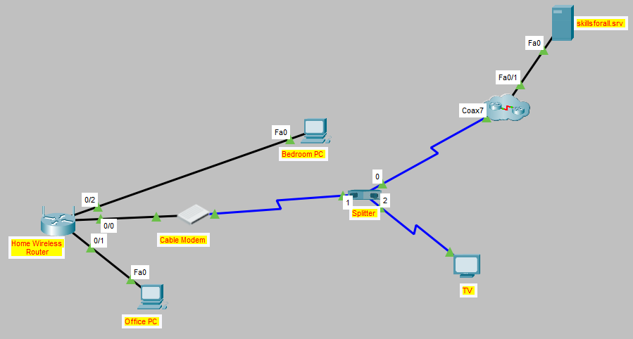

# Cisco Packet Tracer: Small Office / Home Office (SOHO) Network Configuration

## Project Overview
This lab demonstrates the end-to-end setup of a Small Office / Home Office (SOHO) network using Cisco Packet Tracer. The project covers physical layer cabling (coaxial and copper), SOHO wireless router administration via GUI, DHCP IP pool configuration, WPA2-Personal wireless security implementation, and host connectivity verification.

---

## Network Architecture & Topology

*(Include a logical topology screenshot here)*

### Network Components & Cabling
* **ISP Gateway / Service Connection:** Cable Splitter connected via Coaxial Cabling to Cable Modem (Data) and Television (Video).
* **WAN Interface:** Copper Straight-Through connection from Cable Modem (Port 1) to SOHO Router (Internet Port).
* **LAN Connections:** Copper Straight-Through connections from SOHO Router GigabitEthernet LAN ports to internal wired hosts (Office PC, Bedroom PC).
* **WLAN Connections:** 2.4 GHz 802.11 Wi-Fi connection for wireless end devices (Laptop).

---

## Configuration Summary

### 1. Router Administration & Security
* **Access Method:** HTTP via Web Browser (`http://<Default_Gateway_IP>`) on local subnet.
* **Authentication:** Updated administrative credentials from default factory settings to custom password policy (`MyPassword1!`).
* **DHCP Server Management:** Configured dynamic IP assignment with a maximum limit of 10 simultaneous lease clients to reduce lease exhaustion risks and restrict rogue attachments.

### 2. Wireless LAN (WLAN) Setup
* **Radio Band:** 2.4 GHz Wireless Radio enabled.
* **SSID:** `MyHome`
* **Security Protocol:** WPA2-Personal (AES Encryption).
* **Pre-Shared Key (PSK):** `MyPassPhrase1!`

---

## Verification & Testing Workflow

1. **DHCP Dynamic Addressing Verification**
   * Verified that wired hosts (Office PC, Bedroom PC) automatically received valid IPv4 addresses in the `192.168.x.x` scope via DHCP.

2. **WLAN Authentication & Association**
   * Configured the wireless interface on the Laptop, authenticated against the `MyHome` SSID using the WPA2 Pre-Shared Key, and verified AP association status.

3. **End-to-End Connectivity Validation**
   * Executed Web Browser HTTP requests to external domain `skillsforall.srv` across all endpoints (Office PC, Bedroom PC, and Laptop).
   * Verified successful DNS resolution, IP routing through the cable gateway, and full external network access across both wired and wireless segments.

---

## Key Technical Skills Demonstrated
* Physical Media & Interfaces (Coaxial, Copper Straight-Through, Ethernet/FastEthernet/GigabitEthernet Ports)
* SOHO Wireless Router & Access Point Administration
* DHCP Pool & IP Addressing Configuration
* Wireless Security Implementation (WPA2-Personal / Pre-Shared Key)
* Network Troubleshooting & Connectivity Verification (DNS, Gateway Reachability, HTTP Testing)
